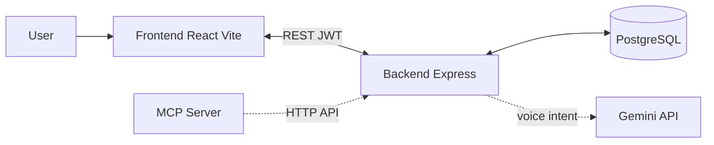

# BeMe – Life Management Application

A comprehensive life-management application for tracking money, body, energy, schedule, goals, and groups—with an optional voice agent and full backend API. Built with React, TypeScript, and Node/Express.

## Features

### Dashboard (Home)
- Financial summary (balance, income, expenses)
- Daily schedule overview and quick edit
- Quick stats (workouts, energy, savings)
- Navigation to all areas

### Money
- Income and expense tracking
- Monthly balance and trend charts
- Transaction categories and recurring support
- Filter by income / expense / all

### Body
- Workout logging with exercise details (sets, reps, weight)
- Weekly workout streaks and frequency charts
- Types: strength, cardio, flexibility, sports
- Duration and notes

### Energy
- Daily wellness check-ins
- Sleep hours tracking
- Food entries with calories and macros (protein, carbs, fats)
- Calorie and energy trend charts

### Schedule
- Daily schedule items with start/end time and category
- Categories: Work, Exercise, Meal, Sleep, Personal, Social, Other
- Optional recurrence (daily, weekdays, weekends)

### Goals
- Goals by type: calories, workouts, savings
- Periods: weekly, monthly, yearly
- Progress tracking on dashboard and insights

### Groups
- Create and manage groups (household, event, project)
- Member list and settings (invitations placeholder)

### Voice Agent
- Speak in natural language to add or edit schedule, transactions, workouts, food, sleep, and goals
- Powered by Google Gemini; requires backend with `GEMINI_API_KEY`
- Supports Hebrew and English

### Authentication
- Email/password signup and login
- Social login: Google, Facebook, Twitter (when backend and env are configured)
- JWT-based sessions; protected routes require login when using the backend

## Architecture



- **Frontend**: React SPA; talks to backend when `VITE_API_URL` is set; stores JWT in localStorage and sends it on every API request.
- **Backend**: Express API; auth routes (register, login, social), domain APIs (schedule, transactions, workouts, food entries, daily check-ins, goals), food search, and voice `/api/voice/understand`. All domain data is stored in PostgreSQL and scoped by user.
- **Voice**: Backend sends user text to Gemini with function declarations; Gemini returns intent/parameters; backend executes actions (add/edit/delete schedule, transaction, workout, food, sleep, goal).
- **MCP server**: Optional stdio server that exposes schedule, transactions, and goals as tools/resources by calling the backend API (see [backend/mcp-server/README.md](backend/mcp-server/README.md)).

## Tech Stack

| Layer    | Technologies |
|----------|--------------|
| Frontend | React 18, TypeScript, Vite, Tailwind CSS, Shadcn UI (Radix), Recharts, React Router v6, TanStack Query (server state), React Context (auth/UI), Zod, React Hook Form, @hookform/resolvers |
| Backend  | Node.js (ES modules), Express, PostgreSQL (pg), JWT, bcrypt, CORS, express-rate-limit, Zod (config and request validation) |
| Voice    | Google Gemini (Generative AI), function calling |
| Auth     | jsonwebtoken, google-auth-library; optional social (Google, Facebook, Twitter) |

## Prerequisites

- **Node.js 18+** and npm (or yarn/pnpm)
- **PostgreSQL** (or compatible host like Supabase) when using the backend for data, auth, food search, or voice “add food”

## Quick Start

### Frontend only

```bash
git clone <repo-url>
cd BMe
npm install
cd frontend && npm install
npm run dev
```

From repo root you can also run `npm run dev` (runs the frontend). Open **http://localhost:5173**.

Without a backend, the app will redirect to login; you need the backend running and configured for full functionality.

### Backend (optional)

```bash
cd backend
npm install
cp .env.example .env   # if available, then edit .env
npm start
```

From repo root: `npm run start:backend` or `npm run dev:backend` (with `--watch`).

Create `backend/.env` with at least:

- `DATABASE_URL` – PostgreSQL connection string (required for data API, auth, food search, voice add_food)
- `JWT_SECRET` – secret for signing JWTs (required in production)
- `GEMINI_API_KEY` – for voice intent (optional; without it, `/api/voice/understand` returns an error)

Set `VITE_API_URL=http://localhost:3000` (or your backend URL) in `frontend/.env` or `frontend/.env.development` so the frontend uses the API.

## Running with Docker

You can run the backend and/or frontend in Docker.

**Backend only**

```bash
docker build -t beme-backend ./backend
docker run -p 3000:3000 --env-file backend/.env beme-backend
```

Create `backend/.env` with at least `DATABASE_URL` and `JWT_SECRET` (see [Environment Variables](#environment-variables)).

**Frontend only**

The built app needs the API URL at build time so the browser can call your backend:

```bash
docker build -t beme-frontend --build-arg VITE_API_URL=http://localhost:3000 ./frontend
docker run -p 5173:3000 beme-frontend
```

Open http://localhost:5173. Ensure the backend is reachable at the same URL you passed as `VITE_API_URL` (e.g. run the backend on port 3000).

**Both with Docker Compose**

From the repo root:

```bash
docker compose up --build
```

- Frontend: http://localhost:5173  
- Backend: http://localhost:3000  

Create `backend/.env` with the required variables. The frontend image is built with `VITE_API_URL=http://localhost:3000` so the browser can call the backend. Set `CORS_ORIGIN=http://localhost:5173` (or the URL where the frontend is served) so the backend allows requests from the frontend; the compose file sets this by default.

**Required env vars (backend)**  
`DATABASE_URL`, `JWT_SECRET`; for voice: `GEMINI_API_KEY`. **Build-arg for frontend:** `VITE_API_URL` (e.g. `http://localhost:3000`).

## Environment Variables

### Backend (`backend/.env`)

| Variable | Required | Description |
|----------|----------|-------------|
| `DATABASE_URL` | For data/auth/voice/food | PostgreSQL connection string |
| `JWT_SECRET` | Yes in production | Secret for signing JWTs |
| `GEMINI_API_KEY` | For voice | Google Gemini API key |
| `GEMINI_MODEL` | No | Model name (default: `gemini-2.5-flash`) |
| `PORT` | No | Server port (default: 3000) |
| `FRONTEND_ORIGIN` | No | Frontend origin for CORS (default: `http://localhost:5173`) |
| `CORS_ORIGIN` | No | Overrides CORS origin if set |
| `GOOGLE_CLIENT_ID` | For Google login | OAuth client ID (same as frontend) |
| `FACEBOOK_APP_ID` | For Facebook login | Facebook app ID |
| `TWITTER_CLIENT_ID` | For Twitter login | Twitter OAuth client ID |
| `TWITTER_CLIENT_SECRET` | For Twitter callback | Twitter client secret |
| `TWITTER_REDIRECT_URI` | No | Callback URL (default: `http://localhost:3000/api/auth/twitter/callback`) |

Without `DATABASE_URL`, the backend runs but auth and data APIs (schedule, transactions, workouts, food entries, daily check-ins, goals) are disabled. Without `GEMINI_API_KEY`, the voice understand endpoint returns an error.

### Frontend (`frontend/.env` or `frontend/.env.development`)

| Variable | Required | Description |
|----------|----------|-------------|
| `VITE_API_URL` | For backend | Backend base URL (e.g. `http://localhost:3000`) |
| `VITE_GOOGLE_CLIENT_ID` | For Google login | Same as backend `GOOGLE_CLIENT_ID` |
| `VITE_FACEBOOK_APP_ID` | For Facebook login | Same as backend `FACEBOOK_APP_ID` |

Restart the frontend dev server after changing env vars.

## Project Structure

```
BMe/
├── backend/
│   ├── app.js              # Express app, CORS, auth routes, API router
│   ├── index.js            # Entry: config, DB init, start server
│   ├── routes/             # Auth and user routes (top-level)
│   ├── src/
│   │   ├── config/         # Env and constants
│   │   ├── db/             # Pool, schema, init
│   │   ├── middleware/     # Auth, error handler
│   │   ├── routes/         # API route mount (schedule, transactions, etc.)
│   │   ├── controllers/    # Request handlers
│   │   ├── services/       # Business logic
│   │   ├── models/         # Data access
│   │   └── utils/          # Response helpers, validation
│   ├── voice/              # Gemini tool declarations
│   ├── mcp-server/         # MCP server (see backend/mcp-server/README.md)
│   ├── scripts/            # e.g. importFoundationFoods.js
│   └── package.json
├── frontend/
│   ├── src/
│   │   ├── components/     # Layout, shared, ui, area-specific (home, money, body, energy, goals, groups, voice, auth, settings)
│   │   ├── context/       # Auth, app, and feature contexts
│   │   ├── core/api/       # API client, auth, feature API modules
│   │   ├── features/       # Feature modules (auth, money, body, energy, goals, schedule, settings, groups)
│   │   ├── hooks/          # useTransactions, useWorkouts, useSchedule, etc.
│   │   ├── schemas/        # Zod schemas (transaction, workout, foodEntry, voice)
│   │   ├── lib/            # Constants, storage, utils, validation, voiceApi, queryClient
│   │   ├── pages/          # Home, Money, Body, Energy, Groups, Insights, Settings, Login, Signup, AuthCallback
│   │   ├── types/          # TypeScript types
│   │   ├── App.tsx         # App and providers
│   │   ├── main.tsx        # Entry
│   │   └── routes.tsx      # React Router and protected routes
│   ├── public/
│   ├── index.html
│   ├── vite.config.ts
│   └── package.json
├── README.md
├── frontend/README.md
├── backend/README.md
└── FoodData_Central_foundation_food_json_*.json   # Optional; for food import
```

## Root Scripts

From repo root ([package.json](package.json)):

| Script | Description |
|--------|-------------|
| `npm run dev` | Start frontend dev server |
| `npm run build` | Build frontend for production (`frontend/dist`) |
| `npm run preview` | Serve frontend production build |
| `npm run lint` | Run frontend TypeScript check |
| `npm run test` | Run frontend tests |
| `npm run start:backend` | Start backend server |
| `npm run dev:backend` | Start backend with watch mode |

## Data Flow

- When using the backend, the user must **log in** (email/password or social). The backend returns a JWT; the frontend stores it (e.g. in localStorage) and sends it in the `Authorization: Bearer <token>` header on every request ([frontend/src/core/api/client.ts](frontend/src/core/api/client.ts)).
- The backend validates the JWT in [backend/src/middleware/auth.js](backend/src/middleware/auth.js) for protected routes and attaches `req.user`. Domain APIs (schedule, transactions, workouts, food entries, daily check-ins, goals) use the authenticated user ID; data is stored in PostgreSQL.
- **Server state** on the frontend is fetched and cached via **TanStack Query** (useQuery/useMutation). Feature providers (goals, transactions, schedule, workouts, energy) use queries for lists and mutations for add/update/delete, with cache updates on success. Forms use **React Hook Form** with **Zod** validation (e.g. TransactionModal, WorkoutModal, FoodEntryModal). API and voice responses are parsed with **Zod** where applicable.
- **Food search** (`GET /api/food/search`) is public (no auth). **Voice** (`POST /api/voice/understand`) requires auth; the backend uses Gemini to parse intent and then executes the corresponding tools (schedule, transaction, workout, food, sleep, goal) in the DB.

## Food Data Import

Food search and voice “add food” use the **USDA Foundation Foods** data in the `foundation_foods` table. One-time import:

1. Place the Foundation Foods JSON file (e.g. `FoodData_Central_foundation_food_json_2025-12-18.json`) in the **project root** (or path expected by the script).
2. Set `DATABASE_URL` in `backend/.env`.
3. From `backend`: `npm run import:foods`  
   Or from repo root: `node backend/scripts/importFoundationFoods.js`

## MCP Server

The backend includes an MCP server that exposes BeMe schedule, transactions, and goals as tools and resources. It talks only to the backend API (no direct DB). See **[backend/mcp-server/README.md](backend/mcp-server/README.md)** for setup and Cursor MCP configuration.

## Building for Production

- **Frontend**: `npm run build` (from root or `frontend/`). Output is in `frontend/dist`. Serve with any static host.
- **Preview**: `npm run preview` to test the production build locally.
- **Backend**: Set `NODE_ENV=production`, `JWT_SECRET`, and `DATABASE_URL`; run `npm run start:backend` or use a process manager (e.g. PM2).

## Responsive Design

The app is responsive and works on desktop and mobile. Theme (light/dark/system) is configurable in Settings.

## Update 6.0

This section records changes added in this revision and planned library adoptions that are not yet fully reflected in the body of the README.

### Already in the repo (documentation catch-up)

- **Docker**: The repo includes `backend/Dockerfile`, `frontend/Dockerfile`, and root `docker-compose.yml`. The main README already describes “Running with Docker” above; the backend and frontend READMEs do not yet list their respective Dockerfiles in project structure.
- **MCP server**: The backend MCP server ([backend/mcp-server/](backend/mcp-server/)) uses **Zod** for validating tool inputs and responses. The main backend app does not yet use Zod for config or request bodies.

### Library adoption (implemented)

The following have been implemented to reduce boilerplate and improve type safety:

- **Zod (frontend and backend)**: Schemas for form payloads, API response shapes, and voice action parsing on the frontend; config validation and request-body validation on the backend. Will replace or complement custom validators in `frontend/src/lib/validation.ts` and `backend/src/utils/validation.js`.
- **TanStack Query (React Query)**: Server state (goals, transactions, schedule, workouts, energy, groups) via `useQuery`/`useMutation` instead of only Context + `useState`/`useEffect`. Will add caching, refetch, and retries; provider tree may be simplified.
- **React Hook Form + @hookform/resolvers (zod)**: Forms (e.g. TransactionModal, WorkoutModal, FoodEntryModal) will use React Hook Form with Zod resolver instead of manual `formData`/`errors` state and ad-hoc validation.
- **Zustand (optional)**: Optional client state store for auth or UI (e.g. theme, modals) to reduce Context nesting after server state moves to TanStack Query.

The main README **Tech Stack** and **Data Flow** sections have been updated accordingly. Zustand remains optional for future client-state consolidation.

## License

MIT

## Contributing

Contributions are welcome. Please open an issue or submit a Pull Request.
