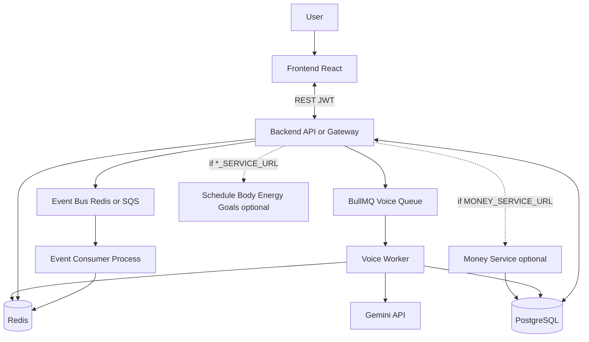

# BeMe – Life Management Application

**BeMe** (BMe) is a full-stack life-management app for tracking **money**, **body**, **energy**, **schedule**, **goals**, and **groups**, with an optional **voice agent** powered by Google Gemini. Built with **React**, **TypeScript**, **Vite**, and **Node/Express**; data is stored in **PostgreSQL**; optional **Redis** for rate limiting, caching, async voice processing, and event bus.

## Features

### Dashboard (Home)
- Financial summary (balance, income, expenses)
- Daily schedule overview and quick edit
- Quick stats (workouts, energy, savings)
- Navigation to all areas

### Money
- Income and expense tracking with categories (Food, Housing, Transportation, etc.; income: Salary, Freelance, Investment, Gift)
- Monthly balance and trend charts; balance by period (daily, weekly, monthly, yearly). Weekly period uses the current calendar week (Sunday–Saturday)
- Transaction categories and recurring support; filter by income / expense / all
- All transaction dates sent and stored as local calendar date (YYYY-MM-DD)

### Body
- Workout logging with exercise details: name, sets, reps, weight (kg). Title (default "Workout" or program name like "SS"), list of exercises
- Weekly workout streak and frequency charts. Types: strength, cardio, flexibility, sports

### Energy
- Daily wellness check-ins and sleep hours tracking
- Food entries with calories and macros; calorie and energy trend charts

### Schedule
- Daily schedule items with start/end time and category. Categories: Work, Exercise, Meal, Sleep, Personal, Social, Other. Optional recurrence

### Goals
- Goals by type: calories, workouts, savings. Periods: weekly, monthly, yearly

### Groups
- Create and manage groups (household, event, project); member list and invitations

### Voice Agent
- Speak in natural language to add or edit schedule, transactions, workouts, food, sleep, and goals. Powered by Google Gemini; requires `GEMINI_API_KEY`
- **Text/transcript (sync)**: Send typed or transcribed text; backend returns parsed actions immediately
- **Audio (async, requires Redis)**: Send base64 audio; backend enqueues job, returns jobId; client polls until complete
- **Intents**: add/edit/delete for schedule, transaction, workout, food, sleep, goals. Food-only phrases (e.g. "Diet Coke") → add_food only; explicit amounts (e.g. "bought coffee for 5") → add_transaction
- **Fallback**: If Gemini blocks, backend returns add_food with transcript as name and zero nutrition so the user is never blocked

### Authentication
- Email/password signup and login
- Social login: Google, Facebook, Twitter (when configured)
- JWT-based sessions; protected routes require login

## Technology Flow

Client → **Backend API or Gateway** → (optional proxy to Money/Schedule/Body/Energy/Goals services when `*_SERVICE_URL` set) → PostgreSQL. The API publishes domain events to an **event bus** (Redis BullMQ or SQS). An optional **event-consumer** process runs handlers (e.g. transaction analytics) in a separate deployable. The voice pipeline uses BullMQ for async job processing and Gemini for natural-language intent.

## Architecture



- **Frontend**: React SPA; talks to backend when `VITE_API_URL` is set; stores JWT in localStorage; uses local date and week (Sun–Sat) conventions
- **Backend / Gateway**: Express API; auth, domain APIs (schedule, transactions, workouts, food entries, daily check-ins, goals), food search, voice `/api/voice/understand`, job polling `/api/jobs/:jobId`. When `MONEY_SERVICE_URL` (or other `*_SERVICE_URL`) is set, those paths are proxied to the given URL
- **Event bus**: Redis (BullMQ) or SQS; API publishes domain events; optional **event-consumer** process consumes and runs handlers (e.g. transaction analytics)
- **Redis** (optional): Rate limiting, food search cache, BullMQ voice queue, job result storage, event bus
- **Voice worker**: Processes audio jobs via BullMQ; calls Gemini, writes result to Redis

### Event-driven architecture

- **Bounded contexts** and event types: [docs/bounded-contexts.md](docs/bounded-contexts.md)
- **Event envelope** and consumer contract: [docs/event-schema.md](docs/event-schema.md)
- **Architecture principles**: [docs/architecture-principles.md](docs/architecture-principles.md)

All write paths publish events; consumers can run in-process or as a separate deployable (`node workers/event-consumer.js`).

## Voice Flow

| Mode | Input | Flow | Redis |
|------|-------|------|-------|
| **Text** | `transcript` | `POST /api/voice/understand` → Gemini → `{ actions }` | Not required |
| **Audio** | `audio` + `mimeType` | `POST` → job created in Redis, enqueued → `{ jobId, pollUrl }` → client polls `GET /api/jobs/:jobId` → worker runs Gemini → result in Redis | Required |

Voice Live WebSocket is legacy and disabled; voice uses Browser Web Speech API for capture → text → sync endpoint, or audio → async job when Redis is enabled.

## Tech Stack

| Layer | Technologies |
|-------|--------------|
| Frontend | React 18, TypeScript, Vite, Tailwind CSS, Shadcn UI (Radix), Recharts, React Router v6, TanStack Query, React Context, Zod, React Hook Form, @hookform/resolvers |
| Backend | Node.js (ES modules), Express, PostgreSQL (pg), JWT, bcrypt, CORS, express-rate-limit, Zod, Pino, Helmet |
| Event bus | BullMQ (Redis), optional SQS ([backend/src/events/bus.js](backend/src/events/bus.js)); Zod event envelope ([backend/src/events/schema.js](backend/src/events/schema.js)) |
| Gateway | http-proxy-middleware when `MONEY_SERVICE_URL` (or other `*_SERVICE_URL`) is set |
| Per-context DB | Optional `MONEY_DATABASE_URL`, `SCHEDULE_DATABASE_URL`, etc. ([backend/src/db/pool.js](backend/src/db/pool.js)) |
| Redis | redis, rate-limit-redis, BullMQ (optional) |
| Voice | Google Gemini, function calling, relaxed safety, fallback on block |
| Auth | jsonwebtoken, google-auth-library; optional social (Google, Facebook, Twitter) |
| Migrations | node-pg-migrate |

### Redis Roles (when `REDIS_URL` set)

- **Rate limiting**: Distributed store via rate-limit-redis
- **Food search cache**: 1-hour TTL
- **BullMQ queue**: Async voice job processing
- **Job results**: Stored in Redis for polling
- **Event bus**: BullMQ queue `events` for domain events; API publishes; optional **event-consumer** process (`node workers/event-consumer.js`) consumes and runs handlers (e.g. transaction analytics). See Backend README.

## Conventions

- **Dates**: Local calendar date `YYYY-MM-DD`; `toLocalDateString` / `parseLocalDateString` in [frontend/src/lib/dateRanges.ts](frontend/src/lib/dateRanges.ts)
- **Week**: Sunday–Saturday
- **Weight**: kg in workouts and voice

## Project Structure

```
BMe/
├── backend/
│   ├── app.js              # Express app, CORS, rate limit, gateway proxy (when *_SERVICE_URL), routes
│   ├── index.js            # Entry: config, DB, server, voice worker
│   ├── money-service.js    # Optional standalone Money (transactions) API
│   ├── schedule-service.js # Optional Schedule API
│   ├── body-service.js     # Optional Body (workouts) API
│   ├── energy-service.js   # Optional Energy (food entries, daily check-ins) API
│   ├── goals-service.js    # Optional Goals API
│   ├── workers/
│   │   └── event-consumer.js # Standalone event consumer (no HTTP)
│   ├── src/
│   │   ├── config/         # Env, Zod validation
│   │   ├── db/             # Pool (getPool per context), schema, init
│   │   ├── events/         # bus.js, schema.js, publish.js, transports/sqs.js, consumers/transactionAnalytics.js
│   │   ├── redis/          # Redis client (optional)
│   │   ├── queue/          # BullMQ voice queue
│   │   ├── workers/        # Voice job worker
│   │   ├── middleware/     # Auth, error handler, validateBody
│   │   ├── routes/         # API route mount; conditionally excludes context routes when *_SERVICE_URL set
│   │   ├── controllers/    # Request handlers
│   │   ├── services/       # Business logic
│   │   ├── models/         # Data access
│   │   └── lib/            # Logger
│   ├── voice/              # Gemini tool declarations
│   ├── migrations/         # node-pg-migrate
│   ├── mcp-server/         # MCP server (see backend/mcp-server/README.md)
│   └── scripts/            # importFoundationFoods, etc.
├── frontend/
│   ├── src/
│   │   ├── components/     # Layout, shared, ui, feature-specific
│   │   ├── context/        # Auth, app, notifications, features
│   │   ├── core/api/       # API client, auth, feature APIs
│   │   ├── features/       # money, body, energy, goals, schedule, groups
│   │   ├── hooks/          # useTransactions, useWorkouts, etc.
│   │   ├── lib/            # voiceApi, dateRanges, queryClient, storage
│   │   ├── pages/          # Home, Money, Body, Energy, etc.
│   │   ├── schemas/        # Zod (transaction, workout, foodEntry, voice)
│   │   └── routes.tsx      # React Router, protected routes
│   └── vite.config.ts
├── docker-compose.yml
├── README.md
├── CHANGELOG.md
└── backend/README.md, frontend/README.md
```

## Deployment Modes

- **Mode A — Single process (default):** One backend process (`node index.js`). All routes local; events in-memory or Redis (no separate consumer if Redis not set).
- **Mode B — API + event consumer:** Two processes: `node index.js` (API, publishes to Redis) and `node workers/event-consumer.js` (consumes from Redis, e.g. transaction analytics). Requires `REDIS_URL`.
- **Mode C — Gateway + extracted services:** Set `MONEY_SERVICE_URL`, etc.; run money-service.js (and others) as separate services; main app proxies `/api/transactions`, `/api/money/*`, etc. to those URLs. Client still uses a single `VITE_API_URL` (the gateway).

## Branches and tags

We use a single integration branch and movable tags for environment promotion. CI runs on `main`; tags indicate which commit each environment runs (see [docs/WORKFLOW.md](docs/WORKFLOW.md) for the full flow and diagram).

| Branch | Purpose |
|--------|--------|
| **main** | Single long-lived branch. All merges go here. CI runs here. Source for tags. |
| **feature/\*** (optional) | Short-lived branches for work; merge into `main` via PR. |

| Tag | Points to | Use |
|-----|-----------|-----|
| **dev** | Latest `main` (or chosen commit) | Dev / preview deploy |
| **stage** | Candidate for production | Staging deploy |
| **production** or **v1.2.3** | Released version | Production deploy |

**Minimal dev sequence:** Commit on `main` (or merge a feature into `main`) → push → CI runs → move `dev` tag to that commit (`git tag -f dev && git push -f origin dev`) so the dev environment runs it. Promote to stage/production by moving those tags when ready.

## Quick Start

### Prerequisites

- Node.js 18+
- PostgreSQL (or Supabase) for data, auth, food search, voice

### Frontend only

```bash
git clone <repo-url>
cd BMe
npm install
cd frontend && npm install
npm run dev
```

Open **http://localhost:5173**. Without a backend, the app redirects to login.

### Backend

```bash
cd backend
npm install
cp .env.example .env   # then edit .env
npm start
```

If `.env.example` is missing, see [backend/README.md](backend/README.md) Configuration for required variables.

From root: `npm run start:backend` or `npm run dev:backend` (watch mode).

Required in `backend/.env`: `DATABASE_URL`, `JWT_SECRET`. For voice: `GEMINI_API_KEY`. Optional: `REDIS_URL` (required for audio voice and event bus). For event consumer (Mode B): run `npm run start:consumer` from `backend/` when using Redis.

Set `VITE_API_URL=http://localhost:3000` in `frontend/.env.development` so the frontend calls the API.

## Environment Variables

### Backend (`backend/.env`)

| Variable | Required | Description |
|----------|----------|-------------|
| `DATABASE_URL` | For data/auth/voice/food | PostgreSQL connection string |
| `JWT_SECRET` | Yes in production | Secret for signing JWTs |
| `GEMINI_API_KEY` | For voice | Google Gemini API key |
| `GEMINI_MODEL` | No | Model name (default: `gemini-2.5-flash`) |
| `PORT` | No | Server port (default: 3000) |
| `CORS_ORIGIN` | No | Allowed origin (default from FRONTEND_ORIGIN) |
| `FRONTEND_ORIGIN` | No | Frontend origin (default: `http://localhost:5173`) |
| `REDIS_URL` | For audio voice / rate limit / cache / event bus | Redis URL. When unset: in-memory rate limit, no cache, transcript-only voice |
| `EVENT_TRANSPORT` | No | `redis` \| `sqs`; default `redis` |
| `EVENT_QUEUE_URL` | When `EVENT_TRANSPORT=sqs` | SQS queue URL |
| `AWS_REGION` | When using SQS | AWS region |
| `MONEY_DATABASE_URL`, `SCHEDULE_DATABASE_URL`, `BODY_DATABASE_URL`, `ENERGY_DATABASE_URL`, `GOALS_DATABASE_URL` | No | Per-context DB; fallback `DATABASE_URL` |
| `MONEY_SERVICE_URL`, `SCHEDULE_SERVICE_URL`, `BODY_SERVICE_URL`, `ENERGY_SERVICE_URL`, `GOALS_SERVICE_URL` | No | When set, main app proxies those paths to the given URL |
| `GOOGLE_CLIENT_ID` | For Google login | OAuth client ID |
| `FACEBOOK_APP_ID` | For Facebook login | Facebook app ID |
| `TWITTER_CLIENT_ID`, `TWITTER_CLIENT_SECRET`, `TWITTER_REDIRECT_URI` | For Twitter login | Twitter OAuth |

### Frontend (`frontend/.env.development`)

| Variable | Required | Description |
|----------|----------|-------------|
| `VITE_API_URL` | For backend | Backend URL (e.g. `http://localhost:3000`) |
| `VITE_GOOGLE_CLIENT_ID` | For Google login | Same as backend `GOOGLE_CLIENT_ID` |

## Docker

**Backend only**

```bash
docker build -t beme-backend ./backend
docker run -p 3000:3000 --env-file backend/.env beme-backend
```

**Frontend only** (API URL at build time)

```bash
docker build -t beme-frontend --build-arg VITE_API_URL=http://localhost:3000 ./frontend
docker run -p 5173:3000 beme-frontend
```

**Docker Compose** (backend, frontend, Redis)

```bash
docker compose up --build
```

- Frontend: http://localhost:5173
- Backend: http://localhost:3000

Compose sets `REDIS_URL=redis://redis:6379`, `CORS_ORIGIN=http://localhost:5173`. Create `backend/.env` with `DATABASE_URL` and `JWT_SECRET`.

## Deployment (Railway)

- **Backend**: Set `DATABASE_URL`, `JWT_SECRET`, `CORS_ORIGIN` (frontend origin, e.g. `https://your-frontend.up.railway.app`), `GEMINI_API_KEY`. For Redis, use variable reference: `REDIS_URL=${{Redis.REDIS_URL}}` (Redis service in same project)
- **Frontend**: Build with `VITE_API_URL` = backend URL. Set build arg at deploy
- **Health**: `GET /health` (200); `GET /ready` (200 if DB and Redis reachable)

## Data Flow

- User logs in → backend returns JWT → frontend stores in localStorage, sends `Authorization: Bearer <token>` on every request
- Backend validates JWT, attaches `req.user`; domain APIs scoped by user ID
- **Server state**: TanStack Query (useQuery/useMutation); React Hook Form + Zod for forms; voice responses parsed with Zod
- **Food search** (`GET /api/food/search`) is public. **Voice** requires auth

## Food Data Import

USDA Foundation Foods for food search and voice "add food":

1. Place Foundation Foods JSON in project root (or path expected by script)
2. Set `DATABASE_URL` in `backend/.env`
3. `cd backend && npm run import:foods`

Optional: `npm run remove:non-foundation-foods` to prune foods not in JSON

## MCP Server

Optional stdio server exposing schedule, transactions, goals as tools. See [backend/mcp-server/README.md](backend/mcp-server/README.md). Configure `BEME_MCP_SECRET` and `BEME_MCP_USER_ID` for authenticated access.

## Root Scripts

| Script | Description |
|--------|-------------|
| `npm run dev` | Start frontend dev server |
| `npm run build` | Build frontend |
| `npm run preview` | Serve frontend build |
| `npm run lint` | Frontend TypeScript check |
| `npm run lint:backend` | Backend syntax check |
| `npm run test` | Frontend tests |
| `npm run test:backend` | Backend tests |
| `npm run test:all` | Backend + frontend tests |
| `npm run start:backend` | Start backend |
| `npm run dev:backend` | Backend with watch mode |

From `backend/`: `npm run start:consumer`, `npm run start:money`, `npm run start:schedule`, `npm run start:body`, `npm run start:energy`, `npm run start:goals` (optional entrypoints for event consumer and extracted services).

## Building for Production

- **Frontend**: `npm run build` → `frontend/dist`. Serve with static host or `server.cjs`
- **Backend**: `NODE_ENV=production`, `JWT_SECRET`, `DATABASE_URL`; `npm run start:backend`

## Documentation

- [docs/README.md](docs/README.md) — Documentation index
- [docs/RUNNING.md](docs/RUNNING.md) — Running locally, on Railway, or on AWS
- [docs/WORKFLOW.md](docs/WORKFLOW.md) — Branches, tags, and dev workflow
- [docs/bounded-contexts.md](docs/bounded-contexts.md) — Bounded contexts and event types
- [docs/event-schema.md](docs/event-schema.md) — Event envelope and consumer contract
- [docs/architecture-principles.md](docs/architecture-principles.md) — Event-driven and cross-context rules
- [docs/architecture-current-railway-supabase.md](docs/architecture-current-railway-supabase.md) — Current architecture (Railway + Supabase)
- [docs/architecture-target-aws.md](docs/architecture-target-aws.md) — Target architecture (AWS)
- [docs/scale-harden-aws.md](docs/scale-harden-aws.md) — Short-term and AWS scale/harden plans

## Changelog

**Update 17.0** — AI Insights DB persistence, food UX (liquid/solid, Look up with AI), Money heading deduplication, thinking animations. See [CHANGELOG.md](CHANGELOG.md) for full release history.

## License

MIT. See [LICENSE](LICENSE) for details.

## Security

To report a security vulnerability, see [SECURITY.md](SECURITY.md).

## Contributing

See [CONTRIBUTING.md](CONTRIBUTING.md) and [CODE_OF_CONDUCT.md](CODE_OF_CONDUCT.md). Contributions welcome.
