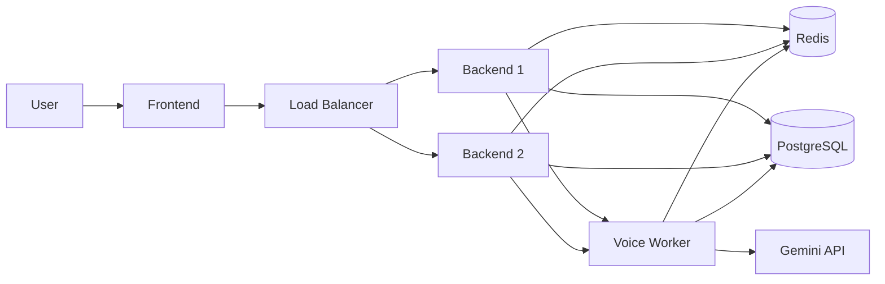
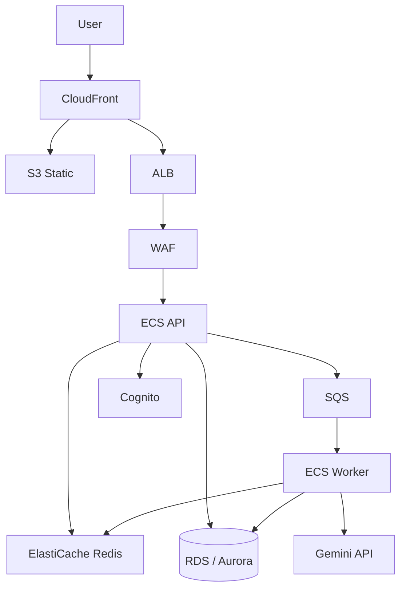

# BMe: Two Plans — Short-Term and AWS

This document splits the scale-and-harden work into **two plans**:

- **Plan 1: Short-term** — Redis-backed workers and state, security quick wins, and observability. No cloud migration; works on current or any host (e.g. Railway, Render, VPS) with Redis.
- **Plan 2: AWS** — Full scalable architecture on Amazon Web Services: Cognito, RDS, SQS, ECS, CloudFront, WAF, etc.

You can do Plan 1 first and later run it on AWS, or do Plan 1 and Plan 2 in sequence when you are ready to move to AWS. Current (Railway + Supabase) and target (AWS) architecture diagrams: [docs/architecture-current-railway-supabase.md](docs/architecture-current-railway-supabase.md), [docs/architecture-target-aws.md](docs/architecture-target-aws.md).

---

## Table of contents

1. [Plan 1: Short-term plan](#plan-1-short-term-plan)
2. [Plan 2: AWS plan](#plan-2-aws-plan)
3. [Reference: options and rationale](#reference-options-and-rationale)

---

# Plan 1: Short-term plan

**Goal:** Harden security, make the app stateless and ready for multiple instances, and add basic observability — **without** moving to AWS. Assumes you have or will add **Redis** (e.g. Redis Cloud, Upstash, or self-hosted).

**Outcome:** Backend can run behind a load balancer with 2+ instances; idempotency and OAuth work across instances; tokens and DB are safer; voice is protected from abuse; you can trace requests and see errors.

---

## 1.1 Scope

| Area | In scope (short-term) | Deferred to AWS plan |
|------|------------------------|------------------------|
| **Shared state** | Redis for idempotency, PKCE, rate limit, BullMQ, cache | ElastiCache (same idea, managed) |
| **Workers** | Keep BullMQ + Redis; tune concurrency/retries; DLQ logging | Replace with SQS + ECS workers |
| **Auth** | One-time code for OAuth callback (no JWT in URL); optional refresh token later | Cognito; no custom auth |
| **DB** | SSL verify in prod; optional CA for managed DB | RDS + RDS Proxy; Secrets Manager |
| **Security** | Voice body limit; MCP scope + audit; request ID + logger | WAF; full IdP; VPC |
| **Observability** | Request ID; structured logs; Sentry (or similar) | CloudWatch; X-Ray |
| **Modularity** | Idempotency key in frontend client; optional shared schemas / voice refactor | — |
| **CI/CD** | npm audit; E2E (e.g. Playwright); deploy staging on merge, prod on tag | CodePipeline / GitHub → ECR → ECS |

---

## 1.2 Prerequisites

- **Redis** available (required for idempotency, PKCE, and multi-instance BullMQ). Set `REDIS_URL` in backend env.
- Backend and frontend already run (e.g. Docker Compose or separate hosts).

---

## 1.3 Ordered checklist (short-term)

Do these in order. Each item is a concrete deliverable.

### Phase A — Redis and stateless backend

1. **Idempotency in Redis**  
   - Store idempotency keys in Redis: `idempotency:{userId}:{key}` with TTL 24h; value = `{ statusCode, body }`.  
   - Remove in-memory `Map()` in `backend/src/middleware/idempotency.js`; use Redis client (same as rate limit).  
   - **Why:** Multiple instances or restarts otherwise create duplicate records on retry.

2. **Twitter PKCE in Redis**  
   - Store `pkce:{state}` → `codeVerifier` in Redis with TTL 10 min in `backend/src/routes/auth.js`.  
   - Replace in-memory `twitterPKCEStore` with Redis get/set/del.  
   - **Why:** OAuth callback can hit a different instance; in-memory state is lost on restart.

3. **Voice workers and queue (already use Redis)**  
   - Ensure BullMQ uses Redis (you already have this when `REDIS_URL` is set).  
   - Add env-based config: `VOICE_WORKER_CONCURRENCY`, `VOICE_WORKER_ATTEMPTS`; on final failure write to `app_logs` or a DLQ store and alert.  
   - **Why:** So workers are tunable and failed jobs are visible.

### Phase B — Security quick wins

4. **Database SSL**  
   - Add `DATABASE_SSL_VERIFY` (default `true` in production). When `true`, use `rejectUnauthorized: true` and system CAs; support optional `DATABASE_SSL_CA` for custom CA.  
   - **Why:** `rejectUnauthorized: false` disables TLS verification and is unsafe in prod.

5. **Voice input size**  
   - Apply a smaller body size limit (e.g. 2MB) only for `POST /api/voice/understand` (e.g. via a dedicated `express.json()` or middleware before the route). Validate `mimeType` allowlist in controller.  
   - **Why:** Global 10MB allows abuse and DoS; base64 audio should be bounded.

6. **OAuth callback: no JWT in URL**  
   - Implement one-time code flow: callback stores `code` → user (or JWT) in Redis with TTL 5 min; redirect to `/auth/callback?code=xxx`. Frontend reads `code`, POSTs to `POST /api/auth/exchange-code`, receives JWT in response body.  
   - **Why:** JWT in query string appears in logs, history, and referrers.

7. **MCP scope and audit**  
   - Restrict MCP to read-only or a small allowlist of actions; log every MCP request (who, what, when) to `app_logs` or an audit table.  
   - **Why:** Static secret + user ID allows indefinite impersonation with no trail.

### Phase C — Observability and client

8. **Request ID and logging**  
   - Middleware: generate or forward `X-Request-Id`; attach to `req`; use a child logger (e.g. `logger.child({ requestId: req.id, userId: req.user?.id })`) for the request; return `X-Request-Id` in response. Replace `console.error` with logger.  
   - **Why:** Correlate logs for a single request; avoid PII in logs.

9. **Error reporting**  
   - Add Sentry (or similar): capture unhandled errors and 5xx; filter PII; set up alerts.  
   - **Why:** Today only Pino; no aggregation or alerting.

10. **Idempotency key on frontend**  
    - In `api/client.ts`, for POST requests to create endpoints, generate `X-Idempotency-Key` (e.g. `crypto.randomUUID()`) if not provided and send it.  
    - **Why:** Backend supports idempotency but frontend doesn’t send the key; double-submit still creates duplicates.

### Phase D — Optional (modularity and CI)

11. **Shared schemas (optional)**  
    - Create `packages/shared` with Zod schemas; backend and frontend import; use `z.infer` for TypeScript types (e.g. npm/pnpm workspaces).  
    - **Why:** Single source of truth; less drift between API and client.

12. **Voice API reuse (optional)**  
    - In `frontend/src/lib/voiceApi.ts`, use `getApiBase()` and `getToken()` from `api/client.ts` instead of duplicating.  
    - **Why:** One place for base URL and auth.

13. **CI: security and E2E**  
    - Run `npm audit` in CI; fail on high/critical. Enable Dependabot (or Snyk) for dependency updates.  
    - Add E2E tests (e.g. Playwright) for critical flows (login, create transaction, voice); run in CI.  
    - **Why:** Catch vulnerabilities and regressions before deploy.

14. **Deploy pipeline**  
    - Deploy to staging on merge to `main`; deploy to production on tag (e.g. `v1.2.3`) via GitHub Actions or similar.  
    - **Why:** Clear promotion path and staging environment.

---

## 1.4 Short-term architecture (after Plan 1)

- **Stateless backend:** Any instance can serve any request; idempotency and PKCE in Redis.  
- **Single Redis:** Rate limit, idempotency, PKCE, BullMQ, optional food cache.  
- **Workers:** BullMQ + Redis; env-tunable; failed jobs logged and alerted.

---

# Plan 2: AWS plan

**Goal:** Run BMe on **Amazon Web Services** with a scalable, FAANG-style architecture: managed auth (Cognito), managed DB (RDS/Aurora + RDS Proxy), managed queue (SQS), managed compute (ECS Fargate), CDN (CloudFront), and WAF.

**Outcome:** Production-grade scalability, security, and ops on AWS; no custom OAuth or in-app secrets; horizontal scaling and global delivery.

---

## 2.1 Scope

| Area | AWS approach |
|------|---------------|
| **Auth** | Amazon Cognito (User Pools + federation); no custom register/login/refresh or PKCE store. |
| **Secrets** | AWS Secrets Manager (and Parameter Store for non-secret config). |
| **Database** | RDS PostgreSQL or Aurora; RDS Proxy for connection pooling; SSL on; private subnet. |
| **Cache / state** | ElastiCache for Redis (idempotency, rate limit, cache); same concepts as short-term. |
| **Queues** | SQS for voice jobs; DLQ; workers as ECS tasks (or Lambda). |
| **Compute** | ECS Fargate for API and workers; ALB in front of API. |
| **Edge** | WAF on ALB (rate limit, body size); optional API Gateway for quotas/usage plans. |
| **CDN / static** | CloudFront + S3 for frontend; optional CloudFront origin = ALB for cacheable GETs. |
| **Observability** | CloudWatch Logs and Metrics; AWS X-Ray for tracing; Sentry (or similar) for errors. |
| **CI/CD** | CodePipeline or GitHub Actions → build image → ECR → deploy to ECS (staging then prod). |

---

## 2.2 Prerequisites

- Plan 1 done (or acceptable to do Redis-related work on AWS directly: ElastiCache + idempotency/PKCE in Redis, then migrate auth to Cognito).
- AWS account; ability to create VPC, RDS, ElastiCache, ECS, SQS, CloudFront, etc.

---

## 2.3 AWS service map

| Area | AWS service | Notes |
|------|-------------|--------|
| **Auth** | **Amazon Cognito** | User Pools + federation (Google, Facebook, etc.). Backend validates Cognito JWT only. |
| **Secrets** | **AWS Secrets Manager** | DB credentials, API keys. Rotate DB secrets on a schedule. |
| **Config** | **AWS Systems Manager Parameter Store** | Non-secret config (e.g. feature flags, pool size). |
| **Database** | **RDS PostgreSQL** or **Aurora PostgreSQL** | SSL on; RDS CA; `rejectUnauthorized: true`. |
| **Connection pooling** | **RDS Proxy** | In front of RDS/Aurora; app connects to proxy. |
| **Cache / shared state** | **Amazon ElastiCache for Redis** | Idempotency, rate limiting, cache (PKCE obsolete after Cognito). |
| **Queues** | **Amazon SQS** | Voice job queue; DLQ; CloudWatch alarm on DLQ depth. |
| **Compute** | **Amazon ECS (Fargate)** | API service + voice worker service; no EC2 to manage. |
| **Load balancing** | **Application Load Balancer (ALB)** | TLS; health/ready; target ECS API. |
| **Edge / WAF** | **AWS WAF** (on ALB) | Rate limits; request size (e.g. 2MB for voice); bot protection. |
| **API gateway** (optional) | **Amazon API Gateway** | Throttling, usage plans, caching. |
| **CDN / static** | **CloudFront** + **S3** | Frontend in S3; CloudFront in front. |
| **Logs** | **CloudWatch Logs** | Log groups per service; request ID in logs. |
| **Metrics** | **CloudWatch Metrics** | ECS, RDS, ElastiCache, SQS, custom. |
| **Tracing** | **AWS X-Ray** | Distributed tracing; ALB, ECS, RDS integration. |
| **Errors** | **Sentry** (or similar) | With trace ID and context. |
| **CI/CD** | **CodePipeline** or **GitHub Actions** | Build → ECR → ECS; staging on merge, prod on tag or approval. |

---

## 2.4 Network and security

- **VPC:** Public subnets (ALB, NAT gateway) and private subnets (ECS, RDS, ElastiCache).
- **RDS and ElastiCache only in private subnets;** no public DB endpoints.
- **Security groups:** ALB → ECS only; ECS → RDS, ElastiCache, and (via NAT) internet for Gemini and other APIs.
- **Secrets:** ECS tasks get credentials from Secrets Manager (or Parameter Store) at startup; IAM roles for task execution and task role.

---

## 2.5 Runbook order (AWS)

Execute in this order:

1. **VPC and networking** — Public/private subnets; NAT for outbound from ECS.
2. **RDS PostgreSQL + RDS Proxy** — Private subnet; SSL on; credentials in Secrets Manager.
3. **ElastiCache Redis** — Private subnet; migrate idempotency (and any remaining PKCE) to Redis.
4. **ECS Fargate** — API service and voice worker service; ALB in front of API; health/ready on `/health` and `/ready`.
5. **SQS** — Voice job queue; worker tasks consume from SQS; DLQ + CloudWatch alarm (replace or keep BullMQ → SQS adapter as you prefer).
6. **Cognito** — User pool + identity federation; frontend uses Cognito SDK; backend validates Cognito JWT only; remove custom auth endpoints and MCP static secret.
7. **CloudFront + S3** — Frontend build in S3; CloudFront distribution; optional API caching via ALB as origin.
8. **WAF** — Attach to ALB; rate limits and body size rule for `/api/voice/understand`.
9. **CloudWatch + X-Ray + Sentry** — Logs, metrics, traces, error tracking; dashboards and alerts.
10. **CI/CD** — CodePipeline or GitHub Actions → build → ECR → ECS (staging then prod); no secrets in repo; OIDC or IAM role for pipeline.

---

## 2.6 AWS architecture diagram

---

## 2.7 What’s “big” and scalable in the AWS plan

- **Cognito:** No custom auth; no PKCE or token-in-URL; compliance and scaling handled by AWS.  
- **RDS + RDS Proxy:** Managed DB and connection pooling; read replicas when needed.  
- **SQS:** Durable queue; auto-scaling workers; no self-managed Redis for queues.  
- **ECS Fargate:** Auto-scaling API and workers; no servers to patch.  
- **CloudFront + S3:** Global CDN and static hosting.  
- **WAF:** Edge rate limiting and request size enforcement.  
- **CloudWatch + X-Ray:** Centralized logs, metrics, and tracing.  

---

# Reference: options and rationale

This section briefly summarizes the **options (A, B, C)** and **recommendations** for each area, for when you need the “why” or want to choose an alternative.

---

## Security

- **Token storage:** A = httpOnly for both tokens; B = short-lived access + refresh in httpOnly cookie; C = Cognito/IdP. **Recommendation:** B short-term; C on AWS.
- **DB SSL:** A = env flag verify in prod; B = always verify + optional CA; C = VPC + Secrets Manager. **Recommendation:** A + B.
- **MCP:** A = restrict scope + audit; B = short-lived tokens; C = OAuth/device flow. **Recommendation:** A first.
- **Idempotency:** A = Redis; B = PostgreSQL; C = distributed store + gateway. **Recommendation:** A (Redis / ElastiCache).
- **PKCE:** A = Redis; B = stateless state; C = managed IdP. **Recommendation:** A short-term; C on AWS (Cognito).
- **Voice size:** A = per-route 2MB; B = validate in controller; C = WAF/API Gateway. **Recommendation:** A; on AWS add WAF.
- **Secrets in URL:** A = one-time code + exchange endpoint; C = IdP only. **Recommendation:** A; C with Cognito.
- **Logging:** Request ID + child logger; no PII; replace console.error. **Recommendation:** Do in short-term plan.

---

## Scaling

- **Horizontal:** A = Redis for state (stateless app); B = sticky sessions. **Recommendation:** A.
- **DB pool:** A = configurable pool + PgBouncer/RDS Proxy; B = small pool + managed proxy. **Recommendation:** A; on AWS use RDS Proxy.
- **Rate limit:** A = per-endpoint in Redis (e.g. voice); B = credit-based. **Recommendation:** A; on AWS add WAF/API Gateway.
- **Caching:** A = Cache-Control headers; B = server-side Redis. **Recommendation:** A first.
- **Voice queue:** A = env config + DLQ logging; C = SQS + ECS workers. **Recommendation:** A short-term; SQS on AWS.
- **API versioning:** Use `/api/v1/`; deprecation policy. **Recommendation:** Add when you need a breaking change.
- **Read replicas:** Managed replicas (RDS/Aurora) when read load justifies. **Recommendation:** When on AWS and needed.

---

## Modularity

- **Shared schemas:** A = monorepo package with Zod; B = separate npm package; C = schema registry + codegen. **Recommendation:** A (optional in short-term).
- **Idempotency client:** A = central in api/client.ts; B = per-hook. **Recommendation:** A (in short-term checklist).
- **Voice API:** A = reuse getApiBase/getToken from client; C = generated client. **Recommendation:** A (optional in short-term).
- **Errors:** Throw domain errors; error handler maps to status. **Recommendation:** Do over time.
- **Voice service:** Split by layer (parser, executor, actions). **Recommendation:** When refactoring.

---

## Observability

- **Tracing:** A = request ID header; B = OpenTelemetry; C = full distributed tracing. **Recommendation:** A short-term; X-Ray on AWS.
- **Metrics:** A = Prometheus; B = OpenTelemetry; C = SLOs/SLIs, RED/USE. **Recommendation:** B; CloudWatch on AWS.
- **Resilience:** A = retries for Gemini; B = circuit breaker; C = retries + circuit breaker + bulkhead. **Recommendation:** A first; add B if needed.
- **Errors:** A = Sentry; B = self-hosted/log-based. **Recommendation:** A (in both plans).

---

## Worldwide and CI/CD

- **CDN:** A = CloudFront/Cloudflare; B = Vercel/Netlify. **Recommendation:** CloudFront + S3 on AWS.
- **i18n / week start:** react-i18next; user setting for first day of week. **Recommendation:** When targeting multiple locales.
- **Security scan:** npm audit + Dependabot (or Snyk). **Recommendation:** Both (short-term and AWS).
- **E2E:** Playwright. **Recommendation:** Add in short-term.
- **Deploy:** Staging on merge to main; prod on tag. **Recommendation:** Short-term; on AWS use CodePipeline or GitHub Actions → ECR → ECS.

---

**Summary:** Plan 1 gets you Redis-backed workers and state, security and observability quick wins, and a clear path to multi-instance. Plan 2 moves you to AWS with Cognito, RDS, SQS, ECS, CloudFront, and WAF for full scalability and ops.
