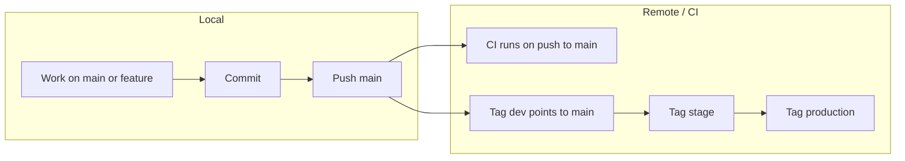

# Development workflow: branches and tags

This document describes how branches and tags are used for development and environment promotion (dev, stage, production).

## Current state

- **CI** (`.github/workflows/ci.yml`) runs on **push** and **pull_request** to `main` (and `master`) only. No deploy jobs yet.
- Intended model: **staging on merge to main, production on tag**.

## Branch strategy

| Branch | Purpose |
|--------|--------|
| **main** | Single long-lived branch. All merges go here. CI runs here. Source for tags. |
| **feature/\*** (optional) | Short-lived branches for work; merge into `main` via PR. |

No separate `develop` branch unless you want explicit staging-from-branch; keeping **main + tags** keeps the model simple and matches "staging on merge, prod on tag."

## Tag strategy

Use **tags** to point at the commit that each environment should run (or to trigger deploys once you add pipeline jobs):

| Tag | Points to | Use |
|-----|-----------|-----|
| **dev** | Latest `main` (or chosen commit) | Dev / preview deploy |
| **stage** | Candidate for production | Staging deploy |
| **production** or **v1.2.3** | Released version | Production deploy |

Tags are **moved** when you promote: e.g. "dev is now this commit," "stage is now this commit," "production is now v1.2.3."

## How it works in dev (concrete example)

Goal: you make a change, push it, and have "dev" run that commit (and later optionally stage/prod).



### Step-by-step: commit and move dev to your change

1. **Work and commit (local)**  
   On `main` (or on a feature branch you will merge to `main`):

   ```bash
   git checkout main
   git pull origin main
   # edit files (e.g. frontend or backend)
   git add .
   git commit -m "feat: add X for dev demo"
   ```

2. **Push to main**  
   If you worked on a feature branch, merge via PR and merge to `main`, then:

   ```bash
   git push origin main
   ```

   CI runs automatically (lint + test + frontend build) for the new commit on `main`.

3. **Point the dev tag at that commit (so "dev" runs this build)**  
   Move the `dev` tag to the current `main` and push the tag:

   ```bash
   git tag -f dev
   git push -f origin dev
   ```

   Any deploy process that "deploys from tag `dev`" will now deploy this commit. If you don't have deploy jobs yet, this at least keeps `dev` in sync with `main` so you can add "deploy on push to tag dev" later.

4. **Promote to stage (when ready)**  
   Same idea: move `stage` to the commit you want in staging, then push:

   ```bash
   git tag -f stage
   git push -f origin stage
   ```

5. **Release to production**  
   Either move a `production` tag or create a version tag and push it:

   ```bash
   git tag -f production
   git push -f origin production
   # or
   git tag v1.0.1
   git push origin v1.0.1
   ```

   Your future pipeline can "deploy production when `production` or `v*` is pushed."

## Optional: CI that deploys on tag push

When you add deploy jobs (e.g. GitHub Actions or CodePipeline), you can:

- **On push to `main`:** run existing CI only (no deploy), or optionally "deploy to staging" from `main`.
- **On push to tag `dev`:** build and deploy to dev environment.
- **On push to tag `stage`:** build and deploy to staging.
- **On push to tag `production` or `v*`:** build and deploy to production (with optional approval).

That way, **branches** (mainly `main`) define what gets tested and what is the source of truth; **tags** define which commit each environment runs and can trigger deploys.

## Summary

- **Branches:** Use `main` as the single integration branch; optional short-lived `feature/*` branches merged via PR.
- **Tags:** Use `dev`, `stage`, and `production` (and/or `v1.2.3`) as movable pointers; moving and pushing a tag "promotes" that commit to that environment.
- **Dev flow:** Commit on `main` (or merge a feature into `main`) → push → run CI → move `dev` (and optionally `stage`/`production`) to that commit and push the tag so the right environment runs it.
