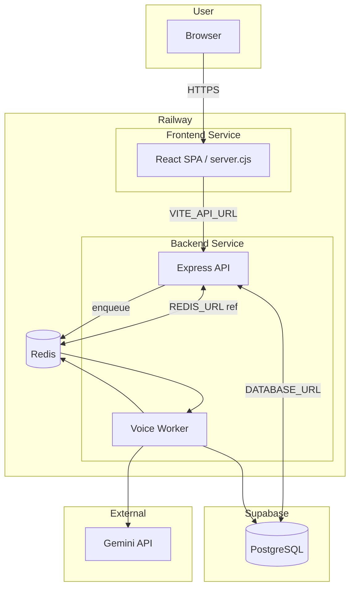

# Current architecture: Railway + Supabase

BeMe today runs on **Railway** (frontend, backend, Redis) and **Supabase** (PostgreSQL).

## Flow summary

- **User** → Frontend (Railway) → Backend (Railway).
- **Backend** uses Supabase for Postgres and Railway Redis for rate limit, cache, BullMQ, job results.
- **Voice worker** runs in the same backend process; reads jobs from Redis, calls Gemini, writes to Redis/Postgres.
