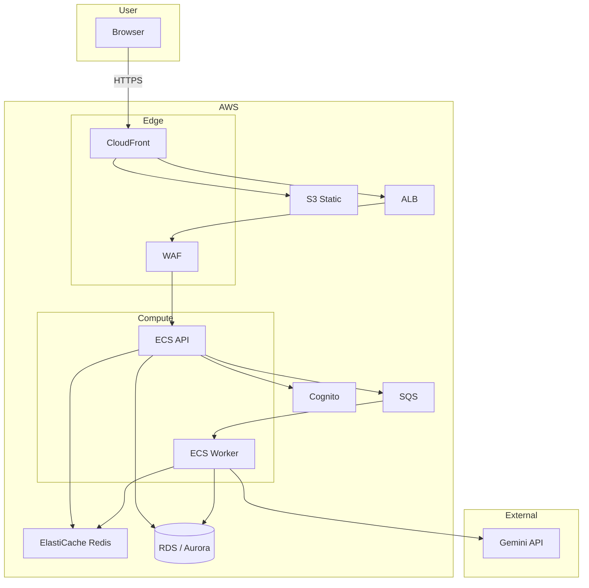

# Target architecture: AWS

After migration (see [scale-harden-aws.md](scale-harden-aws.md)): same app behavior on AWS services.

## Flow summary

- **User** → CloudFront → S3 (static) or ALB (API).
- **ECS API** → RDS, ElastiCache, Cognito, SQS.
- **ECS Worker** consumes SQS, calls Gemini, writes to Redis/RDS.
- Auth via Cognito; queue via SQS (BullMQ/Redis can be phased out).
